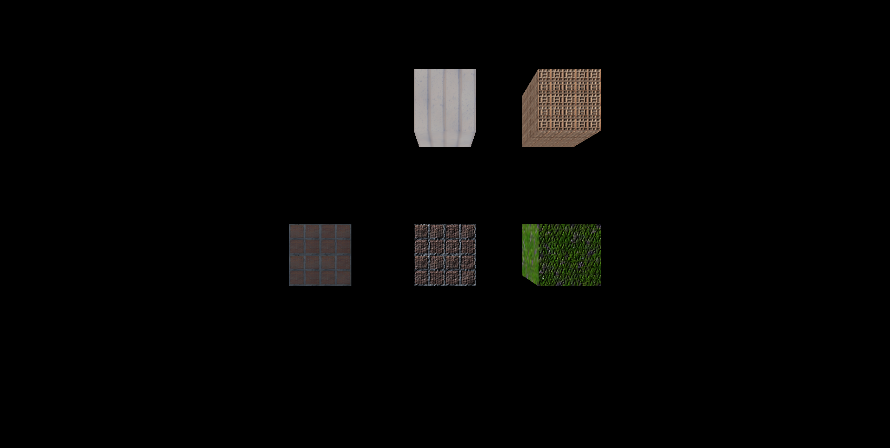
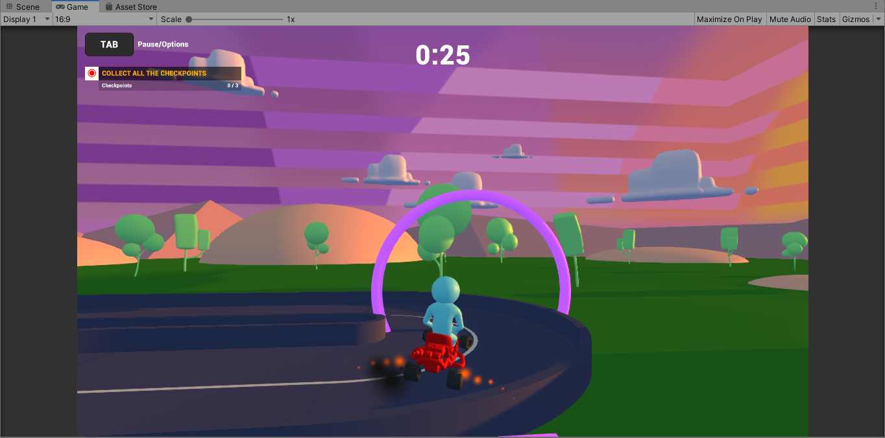
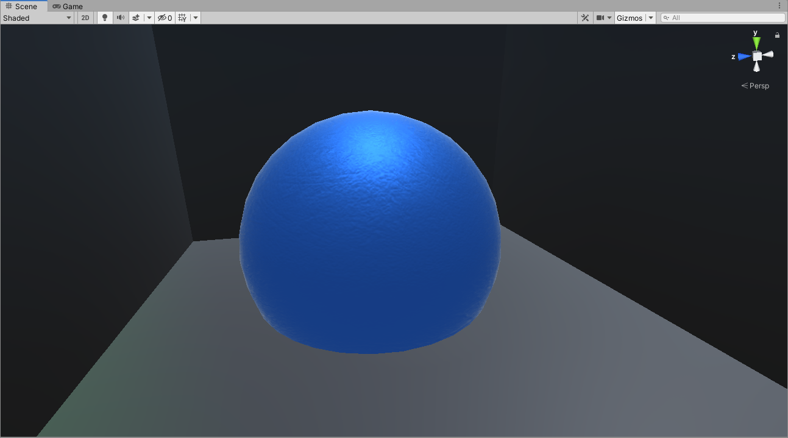
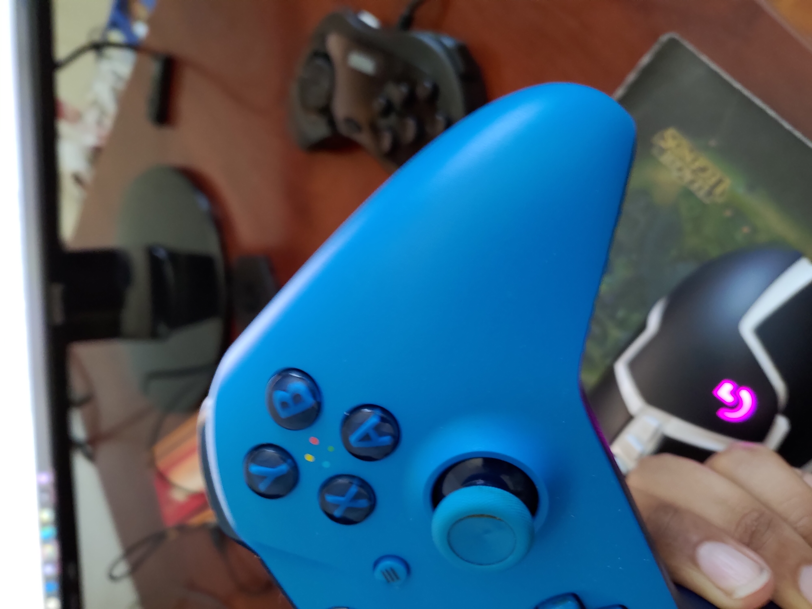
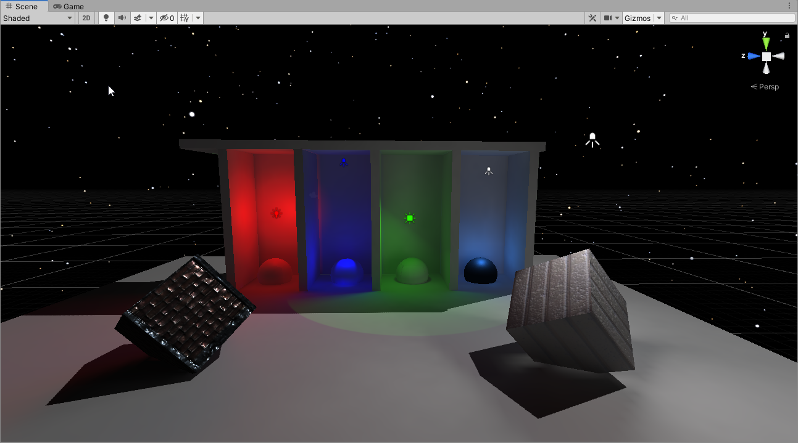
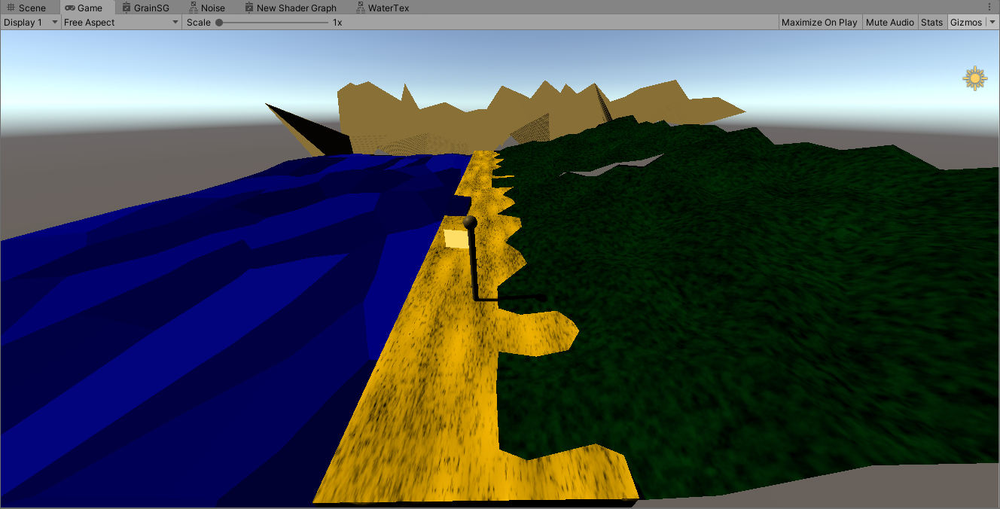

# CMPM163Labs
 
## Lab2

 [Part 1 Video](https://drive.google.com/file/d/1fT3sscdZow4fVg__wP3ExCXg0SP7Tm3A/view?usp=sharing)
 
 Part 2 Image
 
 
## Lab3

 [Lab3 Video](https://drive.google.com/file/d/1E-CuMJIc3UTypj7LUvqj61QNifWSzHhe/view?usp=sharing)
 
 Lab3 Image:  
   Top Left: Three.js phong material with green specular.  
   Top Right: Color interpolation with shaders between pink and teal.  
   Bottom Left: Color interpolation through all axis+time in a sine function between red, green, and blue.  
   Bottom Right: Wireframe with lambert material.  Peach color, and grey emmisive gives it two tones.  
 

  
## Lab4

[Lab4 Video](https://drive.google.com/file/d/1dzP2sAbAOifWZQALaElPy3QV8X_36Vm-/view?usp=sharing)

Lab4 Image:  
   Bottom Left: Three.js texture no normal.  
   Bottom Middle: Three.js texture + normal.  
   Bottom Right: Mismatching Three.js texture and normals.  
   Top Middle: Texture through fragment shader.  
   Top Right: Tiled texture using modulus(uVu/scale) times scale within the Texture2D function.

24a. floor(u times 7)
24b. floor(v times 7)
24c. white

## Lab5

[Lab5 Video](https://drive.google.com/file/d/1YnSFsufs4y6aAzaPvmLBaPR80eY9wTwb/view?usp=sharing)

Lab5 Image:  
  Changes:  
  -Enviroment ground material  
  -Added buildings to the scene  
  -Removed Trees and rocks  
  -Added smoke particle coming out of exhaust  
  -Changed track and checkpoints  
  -Added ramps  
  

## Lab6

### Unity Lights:
-Directional Light: A light that acts like the sun, it lights up the scene in 1 direction and its position does not matter.
-Area Light: A BAKED light that shines in one direction.  Does not interact with real time lighting, nor non-static objects.
-Point Light: A light that shines out in a sphere. Interacts with real time lighting.
-Spotlight: A light that shines out in a cone. Interacts with real time lighting. Can use unity 2D cookies.

### Unity Material:  
-I tried imitating the material found on my Xbox One controller. I used a the standard specular shader and a simple "grainy" normal map.  After editing the normal map values and the material tiling I ended up with something fairly similar.
  
  

### Unity Texture:
- I created 2 textured objects using the textures and normal maps that I used in lab 4.  For the front left cube, I changed the tiling and put the normal map in the metalic AND normal map inputs in unity.  The front right cube is just a texture + normal from lab 4.

### Unity Skybox:
-This skybox is a night sky taken from the asset store that took multiple images of stars and put them onto a cubemap.

 

## Lab7

[Lab7 Video](https://drive.google.com/file/d/1g-T8Pl7Zk60YR1EN17eN9PK-DUWbB9kP/view?usp=sharing)  
 
### How it was made  
-The "mountian" range in the background was from the unity tutorial.  
-The flag on the flagpole was created with the tutorial video.  
-The grass was created with a seperate shader graph, implementing the untiy tutorial shader in a more simple way. Also created a simple grassy pattern using noise in the shader.  
-The sand was created in a similar way, but without the mesh manipulation.  
-The water was created by mesh manip in the shader graph, then applying voronoi noise, time and color to the albedo.  

### What my partner made  
He made a much more full scene, but without textures or color. He added background noise, a water fall, and some simple particles.  The way the scene itself was constructed was very neat.  My partner used the HDRP while I used the URP.  
-Note we did NOT help each other with any portion of the lab.

