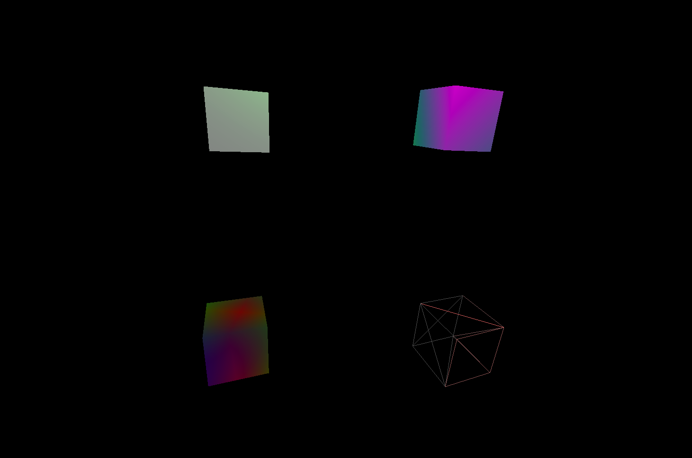

# CMPM163Labs
 
## Lab2

 [Part 1 Video](https://drive.google.com/file/d/1fT3sscdZow4fVg__wP3ExCXg0SP7Tm3A/view?usp=sharing)
 
 Part 2 Image
 
 
## Lab3

 [Lab3 Video](https://drive.google.com/file/d/1E-CuMJIc3UTypj7LUvqj61QNifWSzHhe/view?usp=sharing)
 
 Lab3 Image:  
   Top Left: Three.js phong material with green specular.  
   Top Right: Color interpolation with shaders between pink and teal.  
   Bottom Left: Color interpolation through all axis+time in a sine function between red, green, and blue.  
   Bottom Right: Wireframe with lambert material.  Peach color, and grey emmisive gives it two tones.  
 
